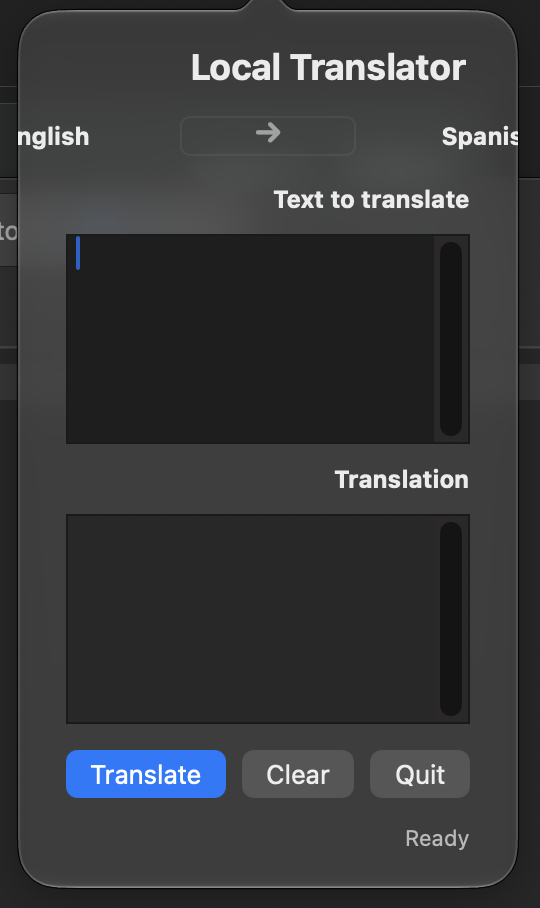

# Local Translator

Local Translator is a small macOS menu bar application for translating between English and Spanish through a local [LM Studio](https://lmstudio.ai/) server. It keeps translation local and does not require a cloud API.



## Features

- Lives in the macOS menu bar.
- Switches between English → Spanish and Spanish → English with one button.
- Opens quickly with **Option + T**.
- Supports copy and paste in both text areas (`⌘C`, `⌘V`, `⌘A`).
- Includes Clear, Translate, and Quit actions.
- Uses a generated application icon and a native AppKit interface.

## Download

Download the latest `LocalTranslator.app.zip` from the [Releases](https://github.com/fjasensi/LocalTranslator/releases/latest) page. Unzip it and move `LocalTranslator.app` to `/Applications`.

The release is unsigned. If macOS blocks the first launch, right-click the app, choose **Open**, and confirm. The app needs LM Studio running locally to translate.

## Configure LM Studio

1. Install and open LM Studio.
2. Start the local server at `http://127.0.0.1:1234`.
3. Load the `qwen/qwen3-1.7b` model.
4. Open Local Translator from the menu bar and press **Option + T** when needed.

## Build from source

Requirements: Xcode with a macOS 26.5 SDK and Swift 5 language mode.

```sh
xcodebuild -project LocalTranslator.xcodeproj \
  -scheme LocalTranslator \
  -configuration Release \
  -derivedDataPath /tmp/LocalTranslator-release-build \
  CODE_SIGNING_ALLOWED=NO build

open /tmp/LocalTranslator-release-build/Build/Products/Release/LocalTranslator.app
```

The project has no third-party package dependencies or automated test target. The app uses AppKit for the menu bar UI, Carbon for the global shortcut, and Foundation networking for the LM Studio API.

## License

No license has been selected yet. Add one before accepting external contributions.
